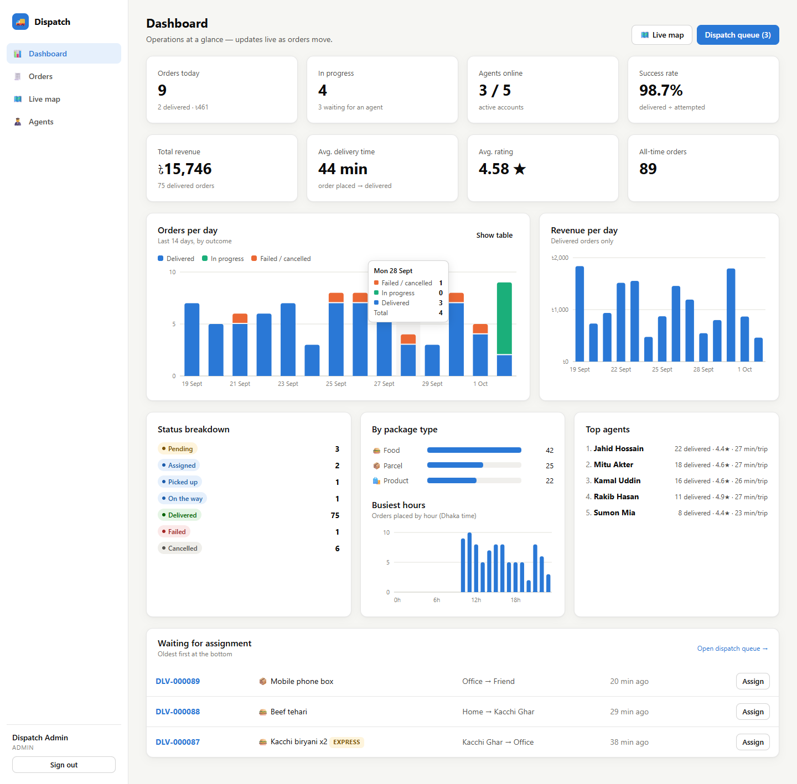
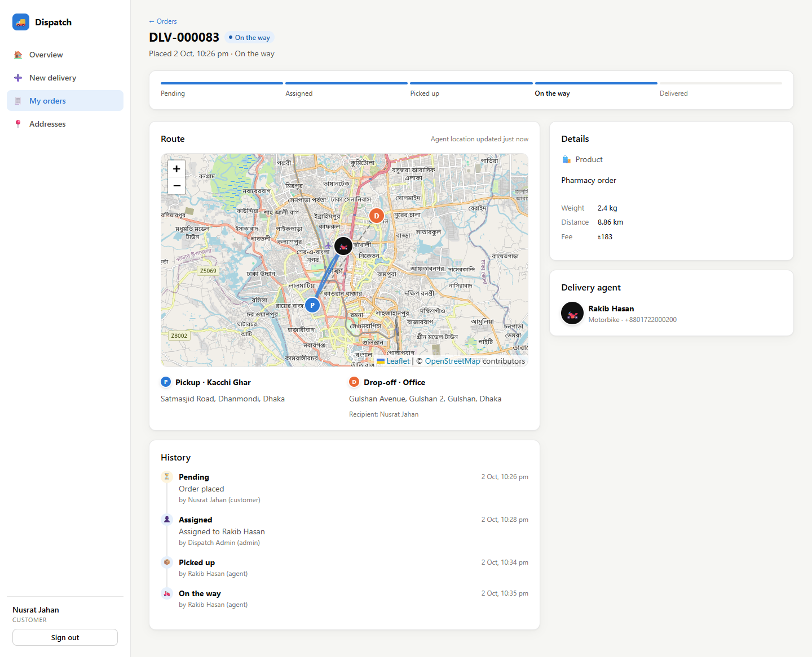
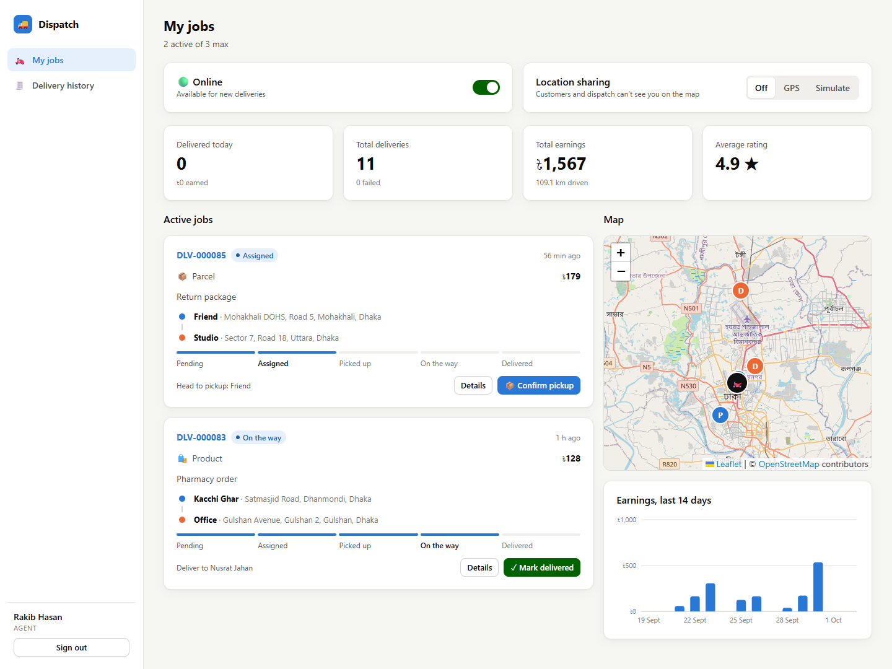
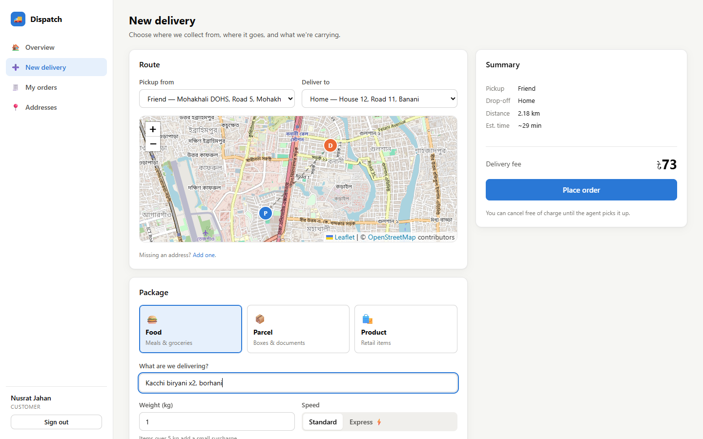
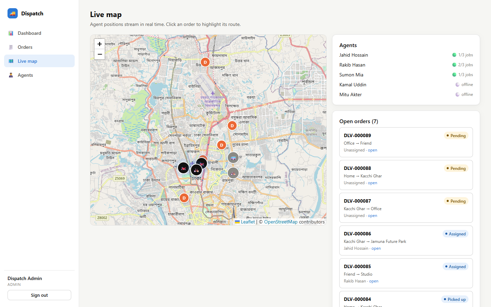
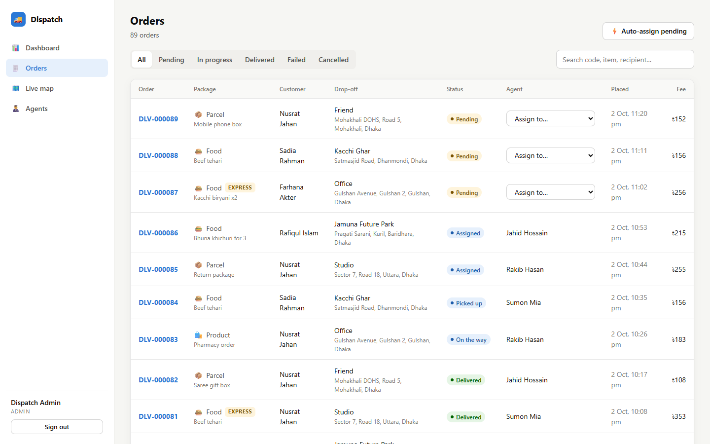
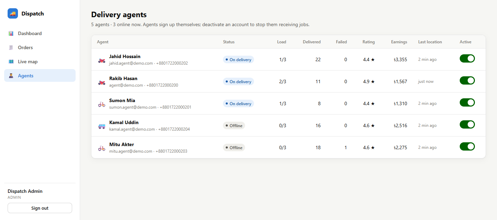
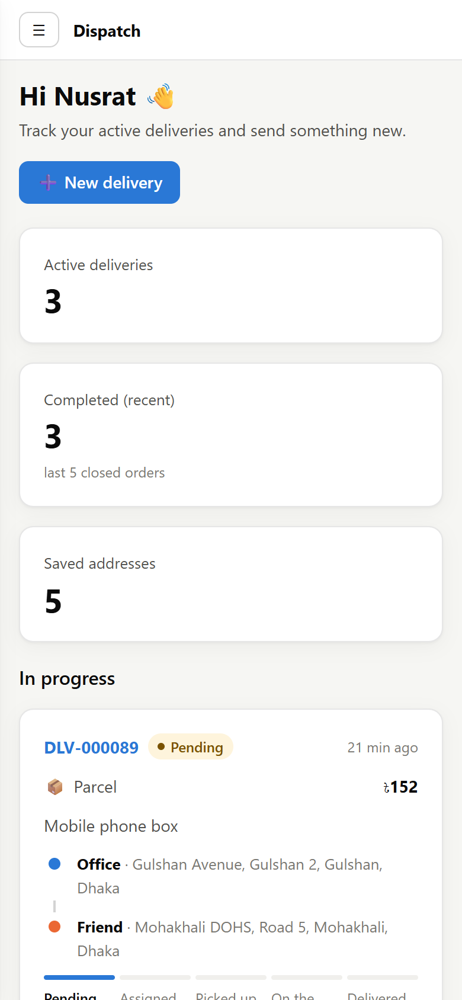

# 🚚 Dispatch — Delivery Management System

A full-stack platform for **Bangladeshi** businesses that deliver food, parcels or products, built around Dhaka: Taka (৳) pricing, Bangladeshi mobile numbers and Dhaka time. Customers place orders, dispatchers assign them to delivery agents, and agents move each order through an enforced lifecycle, sharing their live location as they go.

**Stack:** Node.js · Express 5 · SQLite (built-in `node:sqlite`) · Socket.IO · JWT · React 19 · Vite · Leaflet/OpenStreetMap



## Screenshots

| Live order tracking (customer) | Agent's job board |
|---|---|
|  |  |
| **Placing an order, priced in Taka** | **Admin live map of agents and orders** |
|  |  |
| **Dispatch: orders with inline assignment** | **Delivery agents: load, ratings, earnings** |
|  |  |

<p align="center"><br><em>Works on phones too</em></p>

## Quick start

Requires **Node.js 22.13+** (uses the built-in SQLite module, so there are no native builds).

```bash
npm run install:all   # installs root, server and client dependencies
npm run dev           # API on :4000, web app on http://localhost:5173
```

The database is created and seeded the first time the server starts, with two weeks of demo history around Dhaka (Banani, Gulshan, Dhanmondi, Mirpur, Uttara, Motijheel and more).

| Role     | Email               | Password    |
|----------|---------------------|-------------|
| Customer | customer@demo.com   | customer123 |
| Agent    | agent@demo.com      | agent123    |
| Admin    | admin@demo.com      | admin123    |

The login page also has one-click demo buttons. To see the realtime features, open the customer, agent and admin views in separate browser profiles (or one in a private window).

Other scripts: `npm test` (API tests), `npm run seed` (wipe and reseed), `npm run build && npm start` (production: the API serves the built client on :4000).

## Features

| Feature | Where |
|---|---|
| **Customer orders**: pick saved pickup/drop-off addresses, package type, weight and speed, with a live price quote | Customer → New delivery |
| **Delivery agent accounts**: self sign-up with vehicle type, online/offline toggle, earnings | Register → "I deliver" |
| **Order assignment**: manual, auto-assign (least loaded, then nearest online agent), bulk auto-assign, reassign/unassign, agent rejection | Admin → Orders / order page |
| **Delivery status tracking**: progress stepper plus a full audit timeline (who did what, when) | Every order page |
| **Address management**: CRUD with a map pin, default address, "use my location" | Customer → Addresses |
| **Delivery history**: filterable, searchable, paginated and scoped per role | Orders |
| **Admin dashboard**: KPIs, orders per day by outcome, revenue, status mix, package types, busiest hours, top agents, dispatch queue | Admin → Dashboard |
| **Delivery statistics**: success rate, avg delivery time, ratings; per-agent earnings and distance | Dashboard, Agents, My jobs |
| **Live location tracking**: agents share real GPS or **Simulate** a drive; customers and admins watch the marker and trail move | My jobs → Location sharing; Admin → Live map |
| Ratings & feedback, live toast notifications, agent account deactivation, dark mode, mobile layout | |

## The business workflow

All status changes go through one state machine (`server/src/workflow.js`) that checks **who** may make each transition:

```
pending ──assign (admin/system)──▶ assigned ──pickup (agent)──▶ picked_up ──depart (agent)──▶ in_transit ──▶ delivered
   │                                 │  ▲                           │                            │
   │                                 │  └── reject (agent) /        └──────▶ failed ◀────────────┘
   │                                 │      unassign (admin)               (agent/admin, reason required)
   └──── cancel (customer/admin) ────┴──▶ cancelled
```

Rules enforced on the server:
- Customers can cancel only before pickup. Agents can't cancel, but they can reject an assigned job, which returns it to the queue.
- An agent can hold at most **3 active deliveries**. Disabled agents can't be assigned.
- A failed delivery needs a reason. A delivered order can be rated once, by its customer.
- Orders keep a **snapshot** of their addresses, so editing or deleting an address never rewrites history.
- Customers only see their own orders, and agents only see orders assigned to them. Location is exposed only while a job is active.
- Fee (BDT, whole taka) = base by package type (food ৳40, product ৳50, parcel ৳60) + ৳15/km (straight-line distance × 1.3 road factor) + ৳10/kg over 5 kg, × 1.5 for express. ETAs assume an average of 15 km/h through Dhaka traffic. Agents earn 70%.

## Bangladesh localization

- **Currency:** all prices are in Taka, shown with lakh grouping (৳1,25,000).
- **Phone numbers:** must be Bangladeshi mobiles. `01712345678`, `8801712345678` and `+880 1712-345678` are all accepted and stored as `+8801712345678`. Agents must give one.
- **Time:** timestamps are stored in UTC. The UI shows Dhaka time, and the dashboard groups by Dhaka day and hour (UTC+6, no daylight saving).
- **Vehicles:** bicycle, motorbike, car and van.
- **Maps** default to Dhaka, and the demo data uses real Dhaka areas, Bangladeshi names and local orders (kacchi biryani, fuchka, saree gift boxes…).

Bangladesh settings live in `server/src/bd.js` and `client/src/format.js`.

## Project layout

```
server/
  src/
    workflow.js     order state machine and permissions
    orders.js       order service: create, assign, auto-assign, transitions, location
    pricing.js      distance, fee and ETA
    realtime.js     Socket.IO rooms (user / admins / order) and notifier
    routes/         auth, addresses, orders, agents, stats
    seed.js         deterministic demo data
  test/api.test.js  lifecycle, permission and capacity tests
client/
  src/
    pages/          role-specific screens
    components/     map, charts, tracker, shared UI
```

## API overview

All endpoints are under `/api` and require `Authorization: Bearer <token>` except auth.

| Method | Path | Who |
|---|---|---|
| POST | `/auth/register`, `/auth/login` · GET/PATCH `/auth/me` | anyone |
| GET/POST/PUT/DELETE | `/addresses[/:id]` | any user |
| GET | `/orders?status=&scope=open\|active\|closed&q=&page=` | scoped per role |
| POST | `/orders/quote`, `/orders` | customer |
| GET | `/orders/:id` (with events and location trail) | participants |
| POST | `/orders/:id/status` `{status, note}` | per state machine |
| POST | `/orders/:id/cancel`, `/orders/:id/rate` | customer / admin |
| GET | `/orders/:id/candidates` · POST `/orders/:id/assign`, `/orders/:id/auto-assign`, `/orders/auto-assign-all` | admin |
| GET/PATCH | `/agents/me` | agent |
| GET `/agents` · PATCH `/agents/:id` | admin |
| GET | `/stats/overview` (admin), `/stats/agent` (agent) | |

Socket events: `order:watch` / `agent:location` (client → server); `order:changed`, `agent:location`, `agent:changed` (server → client).

## Configuration

| Env var | Default | |
|---|---|---|
| `PORT` | 4000 | API port |
| `JWT_SECRET` | dev value | **set this in production** |
| `DB_FILE` | `server/data.sqlite` | SQLite path |
| `AUTO_ASSIGN` | `false` | auto-assign new orders as they're placed |
